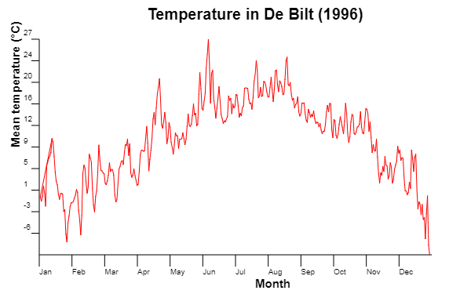

# Week 2
I did not manage to get the http requests working. Because of this, I submit my 'correct' version (knmi_correct.html) where the data
is inside the file, as well as the other files which were meant for the http request.

Image of the temperature line instead of github-pages version

Source: http://projects.knmi.nl/klimatologie/daggegevens/selectie.cgi (01-01-1996 -> 01-01-1997, De Bilt, Average Temperature in degrees celsius)

Created by Steven Schoenmaker (10777679)
